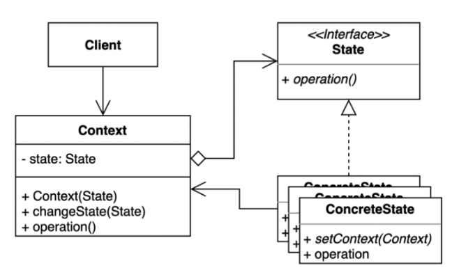
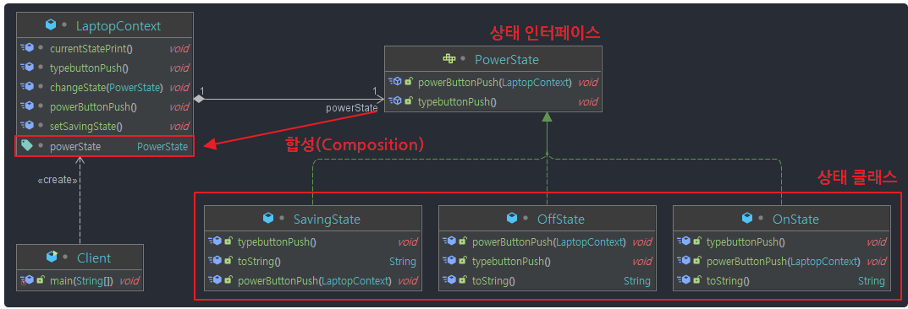

## 상태 패턴( State Pattern )이란?

객체가 특정 상태에 따라 행위를 달리하는 상황에서, 상태를 조건문으로 검사해서 행위를 달리하는 것이 아닌, **상태를 객체화** 하여 상태가 행동을 할 수 있도록 위임하는 패턴.

## 상태 패턴 구조



- **State 인터페이스** : 상태를 추상화한 고수준 모듈.
- **ConcreteState** : 구체적인 각각의 상태를 클래스로 표현. State 역할로 결정되는 인터페이스(API)를 구체적으로 구현한다. 다음 상태가 결정되면 Context에 상태 변경을 요청하는 역할도 한다.
- **Context** : State를 이용하는 시스템. 시스템 상태를 나타내는 State 객체를 합성(composition)하여 가지고 있다. 클라이언트로부터 요청받으면 State 객체에 행위 실행을 위임한다.

## 코드 예시

**요구사항**

- 노트북 전원 ON 상태에서 전원 버튼을 누르면 노트북이 전원 OFF 상태로 변경
- 노트북 전원 OFF 상태에서 전원 버튼을 누르면 노트북이 전원 ON 상태로 변경
- 노트북 전원 절전 모드 상태에서 전원 버튼을 누르면 노트북이 전원 ON 상태로 변경

패턴 적용 전 코드

```java
class Laptop {
    // 상태를 나타내는 상수
    public static final int OFF = 0;
    public static final int SAVING = 1;
    public static final int ON = 2;

    // 상태를 저장하는 변수
    private int powerState;

    Laptop() {
        this.powerState = Laptop.OFF; // 초기는 노트북이 꺼진 상태
    }

    // 상태 변경
    void changeState(int state) {
        this.powerState = state;
    }

    // 전원 버튼 클릭
    void powerButtonPush() {
        if (powerState == Laptop.OFF) {
            System.out.println("전원 on");
            changeState(Laptop.ON);
        } else if (powerState == Laptop.ON) {
            System.out.println("전원 off");
            changeState(Laptop.OFF);
        } else if (powerState == Laptop.SAVING) {
            System.out.println("전원 on");
            changeState(Laptop.ON);
        }
    }

    void setSavingState() {
        System.out.println("절전 모드");
        changeState(Laptop.SAVING);
    }

    void typebuttonPush() {
        if (powerState == Laptop.OFF) {
            throw new IllegalStateException("노트북이 OFF 인 상태");
        } else if (powerState == Laptop.ON) {
            System.out.println("키 입력");
        } else if (powerState == Laptop.SAVING) {
            throw new IllegalStateException("노트북이 절전 모드인 상태");
        }
    }

    void currentStatePrint() {
        if (powerState == Laptop.OFF) {
            System.out.println("노트북이 전원 OFF 인 상태 입니다.");
        } else if (powerState == Laptop.ON) {
            System.out.println("노트북이 전원 ON 인 상태 입니다.");
        } else if (powerState == Laptop.SAVING) {
            System.out.println("노트북이 절전 모드 인 상태 입니다.");
        }
    }
}
```

```java
class Client {
    public static void main(String args[]) {
        LaptopContext laptop = new LaptopContext();
        laptop.currentStatePrint();
        
        // 노트북 켜기 : OffState -> OnState
        laptop.powerButtonPush();
        laptop.currentStatePrint();
        laptop.typebuttonPush();
      
        // 노트북 절전하기 : OnState -> SavingState
        laptop.setSavingState();
        laptop.currentStatePrint();
    
        // 노트북 다시 켜기 : SavingState -> OnState
        laptop.powerButtonPush();
        laptop.currentStatePrint();

        // 노트북 끄기 : OnState -> OffState
        laptop.powerButtonPush();
        laptop.currentStatePrint();
    }
}
```

```java
노트북이 전원 OFF 인 상태 입니다.

전원 on
노트북이 전원 ON 인 상태 입니다.
키 입력

절전 모드
노트북이 절전 모드 인 상태 입니다.

전원 on
노트북이 전원 ON 인 상태 입니다.

전원 off
노트북이 전원 OFF 인 상태 입니다.
```

위 코드의 문제점

- 객체 지향적 코드가 아니다. (하드코딩 스타일)
- 상태 전환이 복잡한 조건 분기문에 나열되어 있어 가독성이 좋지 않다.
- 바뀌는 부분들이 캡슐화 되어있지 않아 노출되어있다.
- 만일 상태 기능을 새로 추가할 경우 메소드를 통짜로 수정해야 하기 때문에, OCP 원칙에 위배 된다.

**상태 패턴을 적용한 코드**

상태 패턴의 핵심은 **'상태'를 객체화** 하라는 것이다. (객체를 지향하라)

노트북의 상태 3가지를 모두 클래스로 구성한다. 그리고 인터페이스나 추상클래스로 묶어 추상화 / 캡슐화(정보 은닉)를 한다. 상태를 클래스로 분리하였으니, 상태에 따른 행동 메소드도 각 상태 클래스마다 구현을 해준다.

결과적으로 코드의 전체 라인수가 길어지고 괜히 클래스도 덕지덕지 많아져서 읽기 거북해 보일 것 같지만, 오히려 이러한 방법이 나중에 유지보수를 용이하게 해준다.



```java
interface PowerState {
    void powerButtonPush(LaptopContext cxt);

    void typebuttonPush();
}

class OnState implements PowerState {
    @Override
    public void powerButtonPush(LaptopContext cxt) {
        System.out.println("노트북 전원 OFF");
        cxt.changeState(new OffState());
    }

    @Override
    public void typebuttonPush() {
        System.out.println("키 입력");
    }

    @Override
    public String toString() {
        return "노트북이 전원 ON 인 상태 입니다.";
    }
}

class OffState implements PowerState {
    @Override
    public void powerButtonPush(LaptopContext cxt) {
        System.out.println("노트북 전원 ON");
        cxt.changeState(new OnState());
    }

    @Override
    public void typebuttonPush() {
        throw new IllegalStateException("노트북이 OFF 인 상태");
    }

    @Override
    public String toString() {
        return "노트북이 전원 OFF 인 상태 입니다.";
    }
}

class SavingState implements PowerState {
    @Override
    public void powerButtonPush(LaptopContext cxt) {
        System.out.println("노트북 전원 on");
        cxt.changeState(new OnState());
    }

    @Override
    public void typebuttonPush() {
        throw new IllegalStateException("노트북이 절전 모드인 상태");
    }

    @Override
    public String toString() {
        return "노트북이 절전 모드 인 상태 입니다.";
    }
}
```

```java
class LaptopContext {
    PowerState powerState;

    LaptopContext() {
        this.powerState = new OffState();
    }

    void changeState(PowerState state) {
        this.powerState = state;
    }

    void setSavingState() {
        System.out.println("노트북 절전 모드");
        changeState(new SavingState());
    }

    void powerButtonPush() {
        powerState.powerButtonPush(this);
    }

    void typebuttonPush() {
        powerState.typebuttonPush();
    }

    void currentStatePrint() {
        System.out.println(powerState.toString());
    }
}
```

```java
class Client {
    public static void main(String[] args) {
        LaptopContext laptop = new LaptopContext();
        laptop.currentStatePrint();
    
        // 노트북 켜기 : OffState -> OnState
        laptop.powerButtonPush();
        laptop.currentStatePrint();
        laptop.typebuttonPush();
 
        // 노트북 절전하기 : OnState -> SavingState
        laptop.setSavingState();
        laptop.currentStatePrint();

        // 노트북 다시 켜기 : SavingState -> OnState
        laptop.powerButtonPush();
        laptop.currentStatePrint();
 
        // 노트북 끄기 : OnState -> OffState
        laptop.powerButtonPush();
        laptop.currentStatePrint();
    }
}
```

### 위 코드 리팩토링 (싱글톤 적용)

왠만한 상황에선 상태는 새로 인스턴스화 할 필요가 전혀 없다. 괜히 메모리 낭비인 셈이다. 따라서 각 상태 클래스들을 **싱글톤**화 시킨다.

아래와 같이 싱글톤을 유지시켜주는 코드를 각 상태 클래스들에 추가해 주면 된다.

```java
class OnState implements PowerState {

	// Thread-Safe 한 싱글톤 객체화
    private OnState() {}
    private static class SingleInstanceHolder {
        private static final OnState INSTANCE = new OnState();
    }
    public static OnState getInstance() {
        return SingleInstanceHolder.INSTANCE;
    }

    @Override
    public void powerButtonPush(LaptopContext cxt) {
        System.out.println("노트북 전원 OFF");
        cxt.changeState(OffState.getInstance()); // 싱글톤 객체 얻기
    }

    @Override
    public void typebuttonPush() {
        System.out.println("키 입력");
    }

    @Override
    public String toString() {
        return "노트북이 전원 ON 인 상태 입니다.";
    }
}

// ...
```

## 비슷한 패턴 (전략 패턴)

State는 Strategy의 확장으로 간주될 수도 있다.

**차이점**

- 전략 패턴과 상태 패턴의 구조는 거의 같지만 어떤 목적을 위해서 사용되는가에 따라 차이가 있다.
- **전략 패턴**은 알고리즘을 객체화 하여 클라이언트에서 유연적으로 전략을 제공 / 교체를 한다.

  **상태 패턴**은 객체의 상태를 객체화하여 클라이언트와 상태 클래스 내부에서 다른 상태로 교체를 한다.


## 정리

### 패턴 사용 시기

- 객체의 행동(메서드)가 상태(state)에 따라 각기 다른 동작을 할때.
- 상태 및 전환에 걸쳐 대규모 조건 분기 코드와 중복 코드가 많을 경우
- 조건문의 각 분기를 별도의 클래스에 넣는것이 상태 패턴의 핵심
- 런타임단에서 객체의 상태를 유동적으로 변경해야 할때

### 장점

- 상태(State)에 따른 동작을 개별 클래스로 옮겨서 관리 할 수 있다.
- 상태(State)와 관련된 모든 동작을 각각의 상태 클래스에 분산시킴으로써, 코드 복잡도를 줄일 수 있다.
- SRP(단일 책임 원칙)를 준수할 수 있다. (특정 상태와 관련된 코드를 별도의 클래스로 구성)
- OCP(개방 폐쇄 원칙)을 준수 할 수 있다. (기존 State 클래스나 컨텍스트를 변경하지 않고 새 State를 도입할 수 있다)
- 하나의 상태 객체만 사용하여 상태 변경을 하므로 일관성 없는 상태 주입을 방지하는데 도움이 된다.

### 단점

- 상태 별로 클래스를 생성하므로, 관리해야할 클래스 수 증가
- 상태 클래스 갯수가 많고 상태 규칙이 자주 변경된다면, Context의 상태 변경 코드가 복잡해지게 될 수 있다.
- 객체에 적용할 상태가 몇가지 밖에 없거나 거의 상태 변경이 이루어지지 않는 경우 패턴을 적용하는 것이 과도할 수 있다.