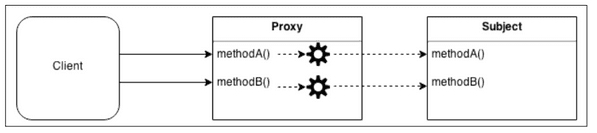
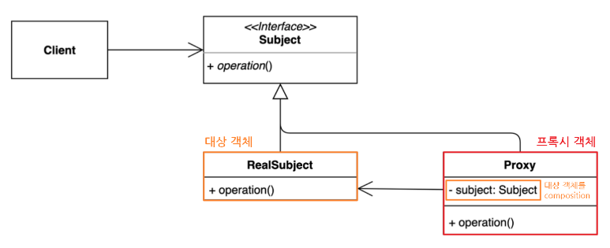

# 프록시(Proxy) 패턴이란?

프록시 패턴(Proxy Pattern)은 대상 원본 객체를 대리하여 대신 처리하게 함으로써 로직의 흐름을 제어하는 행동 패턴이다.

클라이언트가 대상 객체를 직접 쓰는게 아니라 중간에 프록시(대리인)을 거쳐서 쓰는 코드 패턴이라고 보면 된다. 따라서 대상 객체(Subject)의 메소드를 직접 실행하는 것이 아닌, 대상 객체에 접근하기 전에 프록시(Proxy) 객체의 메서드를 접근한 후 추가적인 로직을 처리한뒤 접근하게 된다.



## 패턴 사용 이유

대상 클래스가 민감한 정보를 가지고 있거나 인스턴스화 하기에 무겁거나 추가 기능을 가미하고 싶은데, 원본 객체를 수정할수 없는 상황일 때를 극복하기 위해서.

- **보안(Security)** : 프록시는 클라이언트가 작업을 수행할 수 있는 권한이 있는지 확인하고 검사 결과가 긍정적인 경우에만 요청을 대상으로 전달한다.
- **캐싱(Caching)** : 프록시가 내부 캐시를 유지하여 데이터가 캐시에 아직 존재하지 않는 경우에만 대상에서 작업이 실행되도록 한다.
- **데이터 유효성 검사(Data validation)** : 프록시가 입력을 대상으로 전달하기 전에 유효성을 검사한다.
- **지연 초기화(Lazy initialization)** : 대상의 생성 비용이 비싸다면 프록시는 그것을 필요로 할때까지 연기할 수 있다.
- **로깅(Logging)** : 프록시는 메소드 호출과 상대 매개 변수를 인터셉트하고 이를 기록한다.

## 프록시 패턴 구조



- **Subject** : Proxy와 RealSubject를 하나로 묶는 인터페이스 (다형성)
    - 대상 객체와 프록시 역할을 동일하게 하는 추상 메소드 operation() 를 정의한다.
    - 인터페이스가 있기 때문에 클라이언트는 Proxy 역할과 RealSubject 역할의 차이를 의식할 필요가 없다.
- **RealSubject** : 원본 대상 객체
- **Proxy** : 대상 객체(RealSubject)를 중계할 대리자 역할
    - 프록시는 대상 객체를 합성(composition)한다.
    - 프록시는 대상 객체와 같은 이름의 메서드를 호출하며, 별도의 로직을 수행 할수 있다 (인터페이스 구현 메소드)
    - 프록시는 흐름제어만 할 뿐 결과값을 조작하거나 변경시키면 안 된다.
- **Client** : Subject 인터페이스를 이용하여 프록시 객체를 생성해 이용.
    - 클라이언트는 프록시를 중간에 두고 프록시를 통해서 RealSubject와 데이터를 주고 받는다.


## 프록시 패턴 종류

Proxy 패턴의 기본형을 어떤 방식으로 변형하느냐에 따라 프록시 종류가 나뉘어지게 된다.

- 기본형 프록시

    ```java
    interface ISubject {
        void action();
    }
    
    class RealSubject implements ISubject {
        public void action() {
            System.out.println("원본 객체 액션 !!");
        }
    }
    ```

    ```java
    class Proxy implements ISubject {
        private RealSubject subject; // 대상 객체를 composition
    
        Proxy(RealSubject subject) {
            this.subject = subject;
        }
    
        public void action() {
            subject.action(); // 위임
            /* do something */
            System.out.println("프록시 객체 액션 !!");
        }
    }
    
    class Client {
        public static void main(String[] args) {
            ISubject sub = new Proxy(new RealSubject());
            sub.action();
        }
    }
    ```

    ```java
    원본 객체 액션!!
    프록시 갹채 액션!!
    ```

- ****가상 프록시****
    - 지연 초기화 방식
    - 가끔 필요하지만 항상 메모리에 적재되어 있는 무거운 서비스 객체가 있는 경우
    - 이 구현은 실제 객체의 생성에 많은 자원이 소모 되지만 사용 빈도는 낮을 때 쓰는 방식이다.
    - 서비스가 시작될 때 객체를 생성하는 대신에 객체 초기화가 실제로 필요한 시점에 초기화될수 있도록 지연할 수 있다.

    ```java
    class Proxy implements ISubject {
        private RealSubject subject; // 대상 객체를 composition
    
        Proxy() {
        }
    
        public void action() {
        	// 프록시 객체는 실제 요청(action(메소드 호출)이 들어 왔을 때 실제 객체를 생성한다.
            if(subject == null){
                subject = new RealSubject();
            }
            subject.action(); // 위임
            /* do something */
            System.out.println("프록시 객체 액션 !!");
        }
    }
    
    class Client {
        public static void main(String[] args) {
            ISubject sub = new Proxy();
            sub.action();
        }
    }
    ```

- ****보호 프록시****
    - 프록시가 대상 객체에 대한 자원으로의 엑세스 제어(접근 권한)
    - 특정 클라이언트만 서비스 객체를 사용할 수 있도록 하는 경우
    - 프록시 객체를 통해 클라이언트의 자격 증명이 기준과 일치하는 경우에만 서비스 객체에 요청을 전달할 수 있게 한다.

    ```java
    class Proxy implements ISubject {
        private RealSubject subject; // 대상 객체를 composition
        boolean access; // 접근 권한
    
        Proxy(RealSubject subject, boolean access) {
            this.subject = subject;
            this.access = access;
        }
    
        public void action() {
            if(access) {
                subject.action(); // 위임
                /* do something */
                System.out.println("프록시 객체 액션 !!");
            }
        }
    }
    
    class Client {
        public static void main(String[] args) {
            ISubject sub = new Proxy(new RealSubject(), false);
            sub.action();
        }
    }
    ```

- ****캐싱 프록시****
    - 데이터가 큰 경우 캐싱하여 재사용을 유도
    - 클라이언트 요청의 결과를 캐시하고 이 캐시의 수명 주기를 관리

  **HTTP Proxy**


## ****Spring Framework****

### ****스프링 AOP (AOP, JPA 등)****

스프링에서는 Bean을 등록할 때 Singleton을 유지하기 위해 Dynamic Proxy 기법을 이용해 프록시 객체를 Bean으로 등록한다. 또한 Bean으로 등록하려는 기본적으로 객체가 Interface를 하나라도 구현하고 있으면 JDK를 이용하고 Interface를 구현하고 있지 않으면 내장된 CGLIB 라이브러리를 이용한다.

(스프링 부트에선 default로 CGLIB 라이브러리를 이용하여 클래스를 상속 받는 방식의 Dynamic Proxy를 사용한다고 한다.)

## 정리

### 패턴 사용 시기

- 접근을 제어하거나 기능을 추가하고 싶은데, 기존의 특정 객체를 수정할 수 없는 상황일때
- 초기화 지연, 접근 제어, 로깅, 캐싱 등, 기존 객체 동작에 수정 없이 가미하고 싶을 때

### 장점

- 개방 폐쇄 원칙(OCP) 준수
    - 기존 대상 객체의 코드를 변경하지 않고 새로운 기능을 추가할 수 있다.
- 단일 책임 원칙(SRP) 준수
    - 대상 객체는 자신의 기능에만 집중 하고, 그 이외 부가 기능을 제공하는 역할을 프록시 객체에 위임하여 다중 책임을 회피 할 수 있다.
- 원래 하려던 기능을 수행하며 그외의 부가적인 작업(로깅, 인증, 네트워크 통신 등)을 수행하는데 유용하다

### 단점

- 많은 프록시 클래스를 도입해야 하므로 코드의 복잡도가 증가한다.
    - 예를 들어 여러 클래스에 로깅 기능을 가미 시키고 싶다면, 동일한 코드를 적용함에도 각각의 클래스에 해당되는 프록시 클래스를 만들어서 적용해야 되기 때문에 코드량이 많아지고 중복이 발생 된다.
    - 자바에서는 리플렉션에서 제공하는 동적 프록시(Dynamic Proxy) 기법을 이용해서 해결할 수 있다.
- 프록시 클래스 자체에 들어가는 자원이 많다면 서비스로부터의 응답이 늦어질 수 있다.

## 기타 TMI

<aside>
❔ **Dynamic Proxy**

개발자가 직접 디자인 패턴으로서 프록시 패턴을 구현해도 되지만, 자바 JDK에서는 별도로 프록시 객체 구현 기능을 지원한다. 이를 동적 프록시(Dynamic Proxy) 기법이라고 부른다.

동적 프록시는 개발자가 직접 일일히 프록시 객체를 생성하는 것이 아닌, 애플리케이션 실행 도중 java.lang.reflect.Proxy 패키지에서 제공해주는 API를 이용하여 동적으로 프록시 인스턴스를 만들어 등록하는 방법이다. 그래서 별도의 프록시 클래스 정의없이 런타임으로 프록시 객체를 동적으로 생성해 이용할 수 있다는 장점이 있다.

(이 외에도 ****CGLIB 라이브러리****를 통해 바이트코드를 조작해서 동적으로 프록시를 생성하는 방법도 있다.)

</aside>

```java
// 대상 객체와 프록시를 묶는 인터페이스
interface Animal {
    void eat();
}

// 프록시를 적용할 타겟 객체
class Tiger implements Animal{
@Override
public void eat() {
System.out.println("호랑이가 음식을 먹습니다.");
}
}
```

```java
public class Client {
    public static void main(String[] arguments) {
		
        // newProxyInstance() 메서드로 동적으로 프록시 객체를 생성할 수 있다.
        Animal tigerProxy = (Animal) Proxy.newProxyInstance(
                Animal.class.getClassLoader(), // 대상 객체의 인터페이스의 클래스로더
                new Class[]{Animal.class}, // 대상 객체의 인터페이스
                new InvocationHandler() { // 프록시 핸들러
                    @Override
                    public Object invoke(Object proxy, Method method, Object[] args) throws Throwable {
                        Object target = new Tiger();

                        System.out.println("----eat 메서드 호출 전----");

                        Object result = method.invoke(target, args); // 타겟 메서드 호출

                        System.out.println("----eat 메서드 호출 후----");

                        return result;
                    }
                }
        );

        tigerProxy.eat();
    }
}
```

```java
----eat 메서드 호출 전----
호랑이가 음식을 먹습니다.
----eat 메서드 호출 후----
```